# Install

1. Install [ReaPack](https://reapack.com/)
2. Go to reaper `Extensions > ReaPack > Import repositories`
3. Paste the following address

```
https://raw.githubusercontent.com/tiagolr/tilr_jsfx/master/index.xml
```

# Effects

## MSEG-1

MSEG-1 is a multi-segment LFO / Envelope generator

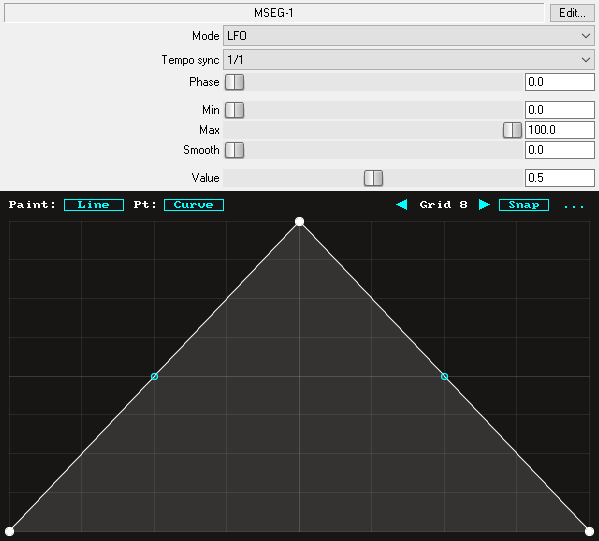

Features:

* Tempo sync or hz rate
* Sync, free and MIDI trigger modes
* Paint mode - erase, line, saw up, saw down ..
* Point type - hold, curve, s-curve, stairs ..
* Output smooth and attack-release smooth

## ADSR-1

ADSR-1 is an ADSR envelope generator

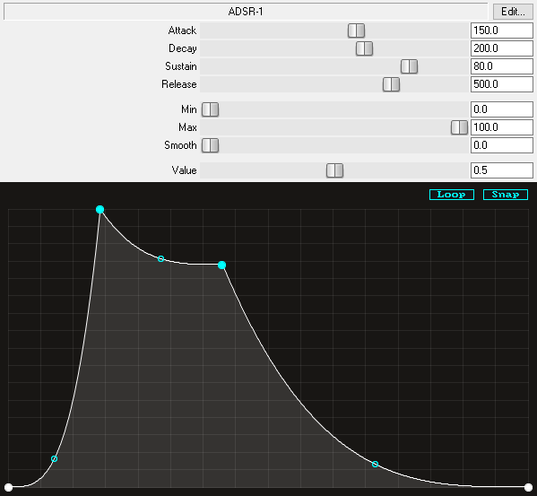

#### Features:

* Multi-segments / control points per stage
* Sustain looping
* Output smooth

## GATE-1

GATE-1 is an envelope generator for gate/volume control

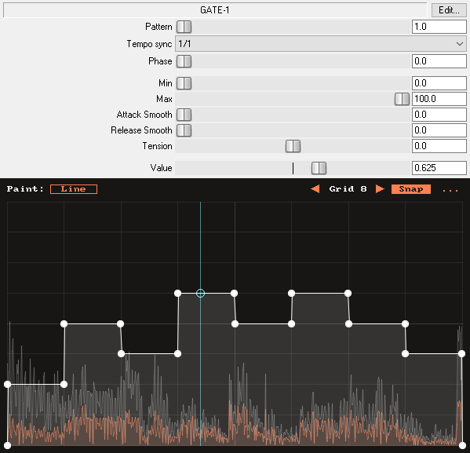

#### Features:

* Multi-segment editor
* 12 patterns triggered by midi notes
* Paint mode - erase, line, saw up, saw down ..
* Point type - hold, curve, s-curve, stairs ..
* Tempo sync or lfo rate (Hz)
* Attack and release smooth
* Pre and post waveform display
* Global tension control

## TIME-1

TIME-1 is a playback/time and pitch editor similar to plugins like GrossBeat and TimeShaper.


#### Features:

* Time and pitch envelope editor
* 12 patterns triggered by midi notes
* Paint mode - erase, line
* Point type - hold, curve, s-curve, stairs ..
* Anti clicking with 3 modes (Off, Low, High)
* Pre and post waveform display

## FLTR-1

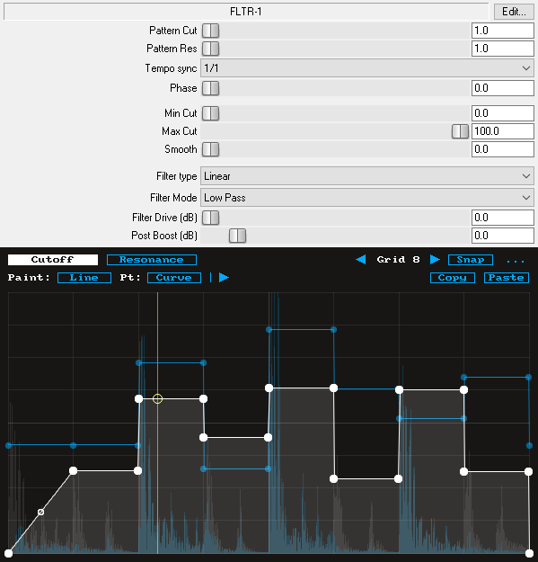

Envelope based filter modulator with 29 filter types.

#### Features:

* 29 filter types from Saikes filters
* Filter drive
* MSEGs for cutoff and resonance
* 12 patterns triggered by midi notes
* Tempo sync or lfo rate (Hz)
* Envelope smoothing
* Pre and post waveform display

## DIST-R

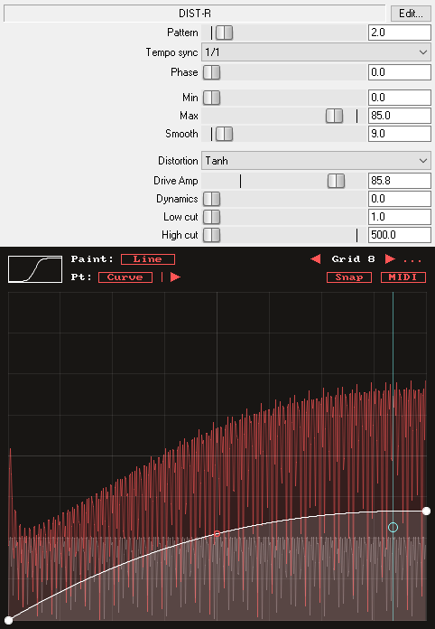

Envelope based waveshaper distortion

#### Features:

* 12 distortion modes
* Multi-segment envelope editor
* 12 midi triggable envelope patterns
* Envelope smoothing
* Oversampling
* Paint modes and point modes
* Pre and post waveform display

## TinyRec

Audio recording utility similar to Image-Line Edison, stores up to 4 minutes at 44100 sample rate.

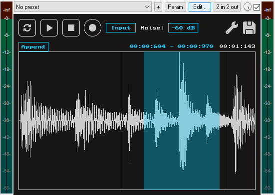

#### Features:

* Record audio up to 4 minutes at 44100 sample-rate
* Can be placed on any track including master and monitor
* Record modes (Now, On Input, Input and On Play)
* Record pre-buffer so transients are not not lost on Input record modes
* Noise gate for input record modes
* Basic wave editing (non-reversible)

#### Record modes:

* **Now** records audio immediately
* **On Input** records audio when signal exceeds noise gate
* **Input** records audio when signal exceeds noise gate, pauses when there is no signal for one second
* **On Play** records audio on host playback

## SKFilter

SKFilter (or Saikes filters) is a set of unique filters extracted from [Yutani Bass](https://github.com/JoepVanlier/JSFX/tree/master/Yutani)

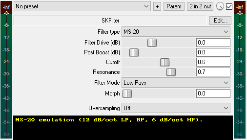

#### Features
* 29 filter types
* Non-linear analog modelled filters
* Filter drive
* Filter modes and morphing
* Oversampling up to 8x

## QuickDelay

Simple delay with ping-pong mode, tempo sync, feedback filters and pitch shift.

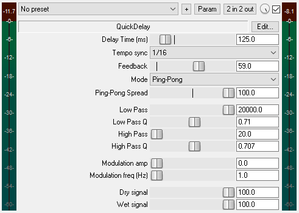

#### Features:

* Normal and ping-pong modes
* Ping-pong stereo width control
* Tempo sync
* Low pass and high pass feedback filters with Q controls
* Pitch shifting
* Delay modulation

## QuickDualDelay

Dual delay with independent or sync times, ping-pong mode, tempo sync, feedback filters and pitch shift.

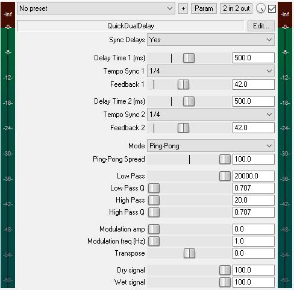

#### Features

* Dual delay with independent or sync time and feedback
* Normal and ping-pong modes
* Ping-pong stereo width control
* Tempo sync
* Low pass and high pass feedback filters with Q controls
* Pitch shifting
* Delay modulation

## QDelay

A nicer interface for QuickDualDelay.

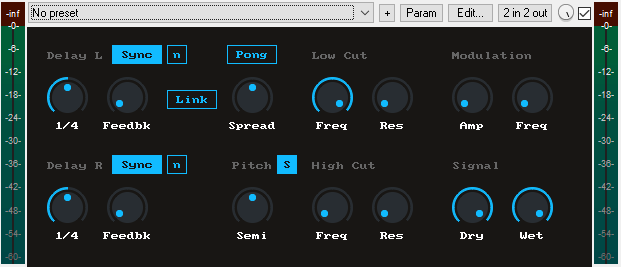]

## QuickDist

Waveshapping distortion with 12 modes.

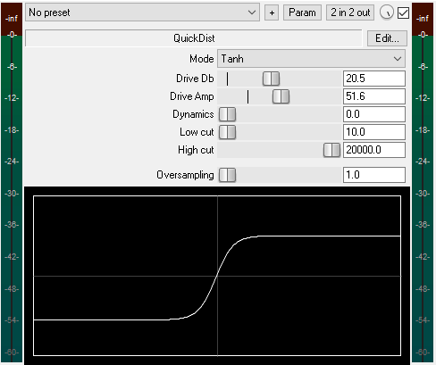

#### Feature

* 12 waveshapping distortion modes
* Dynamics control
* Low and highpass filters
* Oversampling

## QuickFilter

Simple filter with 9 modes and smooth interpolation from ReEQ.


## Notes to CC

Convert midi notes to CC messages, useful for keytracking modulation.

Supports configs like min and max note, min and max CC values, off notes value and more.

# Synths

## Rippler

A physical modeled synth.

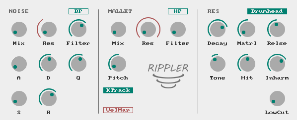

#### Features:

* 7 Models of acoustic resonators: String, Beam, Squared, Membrane, Drumhead, Plate and Marimba.
* Inharmocity, Tone, Ratio and Material sliders to shape the timbre.
* Sample based mallet with 50 samples to chose from.
* Noise generator with filter and ADSR.
* Up to 64 partials (configurable).
* Up to 16 polyphony (configurable).

[Sound demo](https://github.com/tiagolr/tilr_jsfx/raw/refs/heads/master/demos/rippler.flac)

## JS3Osc

JSFX polyphonic synth based of IL 3xOsc.

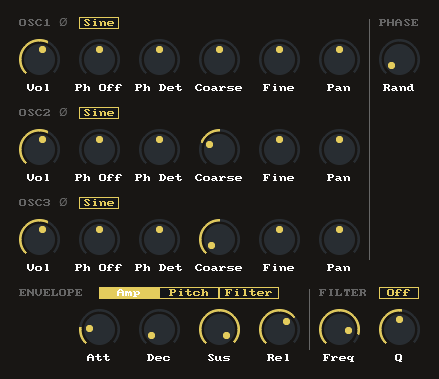

#### Features:

* Polyphonic voicing
* Filter, pitch and amplitude envelopes per voice
* Three oscillators with 6 wave types
* Oscillator phase stereo detuning and offset

## JSwavesynth

JSFX polyphonic synth with a unison engine.

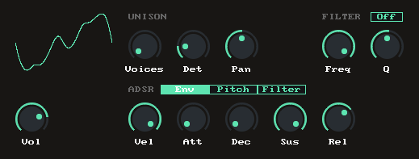

#### Features:

* Single cycle waveforms read from wav files
* Polyphonic voices with independent adsr
* 8 unison voices with detune and panning controls
* ADSR for volume pitch and filter

## JSAdditiv

Polyphonic additive synthesizer

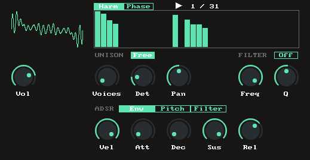

#### Features:

* Wavetable oscillator that reads single cycle waveforms from disk
* Additive synthesis engine that allows to modify the wave
* Wave editors for harmonics amplitude and phase
* 8 voices unison engine
* Pitch, amplitude and filter adsr

## JSModulator

Polyphonic FM synth with 4 operators

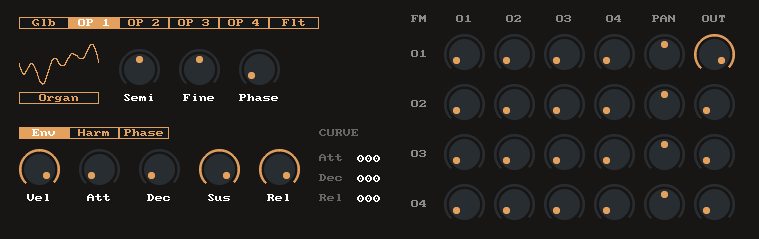

#### Features:

* 4 wavetable operators with additive synthesis
* FM matrix 4x4
* Global envelope and envelope per operator
* Operator harmonics and phase editor
* Filter per voice with envelope ADSR
* Envelope curve/tension controls

## JSDrumpad


JSFX drumpad synth inspired by vsts like Microtonic and DSK Synthdrums.

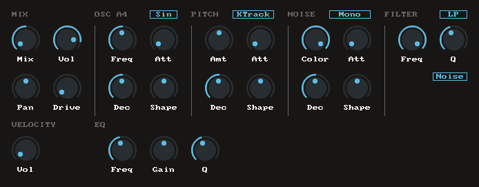

#### Features:

* 1x OSC (Sine, Triangle, Saw, or Square wave)
* 1x Noise generator (Stereo or mono)
* 3x Envelopes (osc, pitch and noise)
* 2x Filter (Noise color/lp, LowPass, BandPass and HighPass)
* 1x Distortion (Tube)
* 1x Band EQ

## JSDrumsynth

Lightweight JSFX drum synth capable of sounding as good (or as bad) as other vsts like Microtonic and DSK Synthdrums.

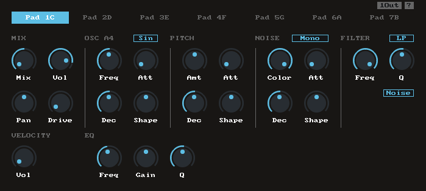

### Features 7x Pads with:

* 1x OSC (Sine, Triangle, Saw, or Square wave)
* 1x Noise generator (Stereo or mono)
* 3x Envelopes (osc, pitch and noise)
* 2x Filter (Noise color/lp, LowPass, BandPass and HighPass)
* 1x Distortion (Tube)
* 1x Band EQ
